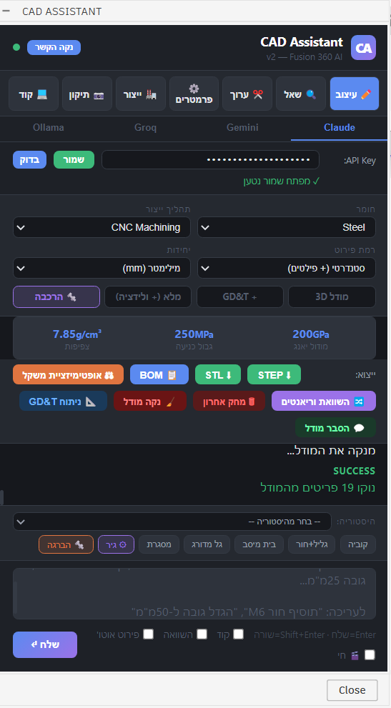
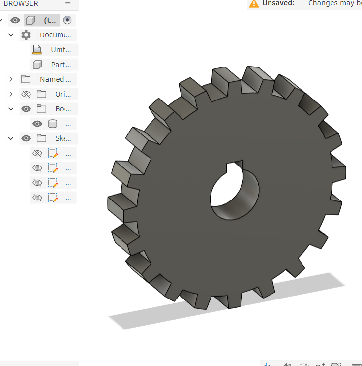
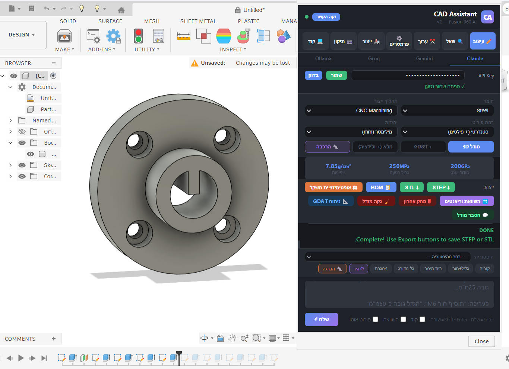
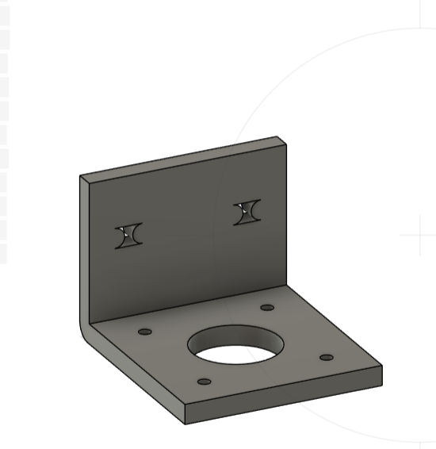
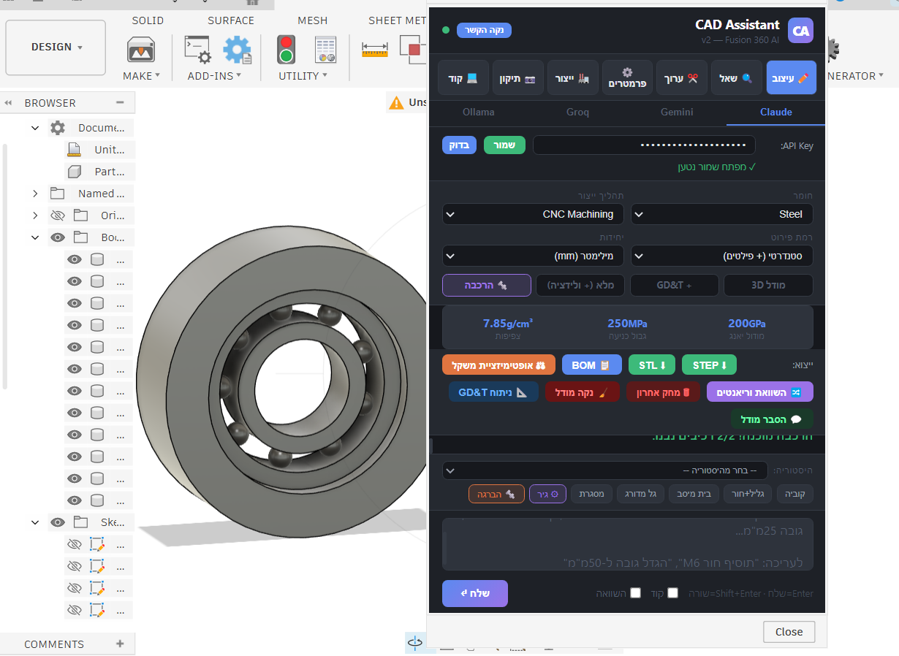
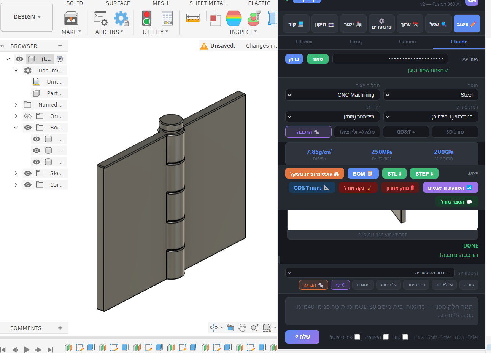
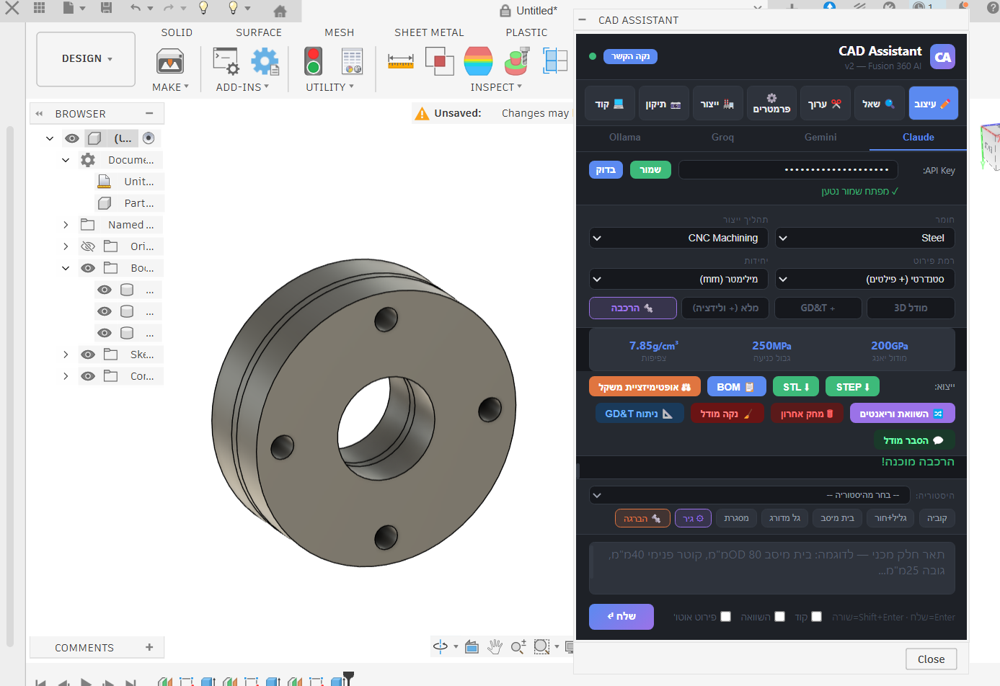

# CAD Assistant v2 — AI‑Powered CAD for Fusion 360

> Describe a mechanical part in plain language — get a real, dimensioned, **verified** parametric 3D model inside Autodesk Fusion 360.

CAD Assistant is a Fusion 360 add‑in that bridges natural language and CAD. You type a description ("a flange coupling with a keyway and 4 counterbored bolt holes") in Hebrew or English, and the add‑in uses a large language model to **write Fusion 360 Python API code**, runs it on Fusion's main thread, **measures the result against your request, and auto‑corrects it** if a dimension drifted.

It supports four AI back‑ends — **Anthropic Claude**, **Google Gemini**, **Groq**, and local **Ollama** — and adds engineering features on top of pure modeling: GD&T analysis, material properties, manufacturing analysis, multi‑component assemblies, and STEP/STL export.



---

## 🖼️ Gallery

All of these were generated from a one‑line natural‑language description.

### Parts
| Spur gear | Flange coupling | L‑bracket |
|---|---|---|
|  |  |  |

### Assemblies
| Bearing in housing | Door hinge | Flange pipe coupling |
|---|---|---|
|  |  |  |

---

## ✨ Features

### Modeling
- **Chat‑to‑CAD** — natural‑language description → a real parametric 3D body, with user parameters for every dimension.
- **Engineering‑grade Part Builder** — builds a clean **feature tree** (base → holes → fillets → chamfers → patterns → threads → shells), parameter‑driven, with **functional names** (`Base_Plate`, `Bearing_Bore` — not `Body1`), and **manufacturing‑aware** geometry that adapts to the chosen process (CNC / FDM / sheet‑metal / injection).
- **Auto‑detail (`פירוט אוטו'`, on by default)** — expands a short request ("coupling") into a full engineering spec (purpose, dimensions, every feature, clearances, fillets, wall thickness) *before* building. Short input → sophisticated output.
- **Accuracy verification loop** — after building, it measures the actual bounding box + parameters, compares them to your request, and **rebuilds a corrected version** if anything drifts more than ~0.5 mm (a QC inspector).
- **Engineering report** — after each build: name, material + yield, process, overall size, body/feature/parameter counts, estimated mass, and warnings.
- **Self‑healing** — if generated code fails in Fusion, the error is fed back to the model, which fixes and re‑runs it (up to 3 retries).
- **Smart editing** — "make the holes 10 mm", "add a chamfer" — applied to the existing model using multi‑turn conversation memory.

### Assemblies
- **Real assemblies** — assembly mode builds **separate Components** (not bodies under Root), each with its own geometry — the correct Fusion structure.
- **Joints & motion** — for mechanisms (hinge, gear, linkage, …) it adds real **Joints** (Rigid / Revolute / Slider / Cylindrical / Planar / Ball), grounds the base, sets limits, and drives a test angle so the assembly actually **moves** in Fusion.
- **Honest validation** — it counts components & joints and **only reports success if the assembly is genuinely valid** (≥2 components, no stray root bodies, a non‑rigid joint when motion is required), with a structured report (components, joints, grounded/moving, drive).
- **Auto intent detection** — keywords like *hinge / ציר / mechanism / gear* automatically switch to a moving‑assembly build.

### Engineering
- **GD&T analysis** — generates datums, feature control frames (with symbols ⊕ ⊥ ∥ ◎), surface finishes, and dimensional tolerances per ASME Y14.5, shown as a formatted report.
- **Material properties** — Steel, Aluminum, Stainless, Titanium, ABS, Nylon, PLA, … with density, yield strength, and Young's modulus.
- **Manufacturing analysis** — analyze a part for a chosen process (CNC, FDM, …).
- **Weight optimization** — suggestions to lighten a part while keeping structural integrity.
- **Engineering validation** — a `MasterValidator` checks the model for issues.
- **Image → CAD** — drag a photo of a broken part to design a 3D‑printable replacement (Claude vision).

### Workflow
- **4 AI providers** — Claude (strongest), Gemini & Groq (free tiers), Ollama (local/offline).
- **Export** — STEP, STL, and BOM generation.
- **Model management** — "clear model", "undo last build", "explain model", natural‑language parameter editing.

---

## 🧠 How it works

```
   You type a description in the panel
                │
                ▼
   Background thread ──HTTP──▶  AI provider (Claude / Gemini / Groq / Ollama)
                │                   │  writes a def build(rootComp, config) function
                │   ◀───────────────┘  (Fusion 360 Python API code)
                │
   sanitize + safety‑validate the code   (fix known API mistakes, block dangerous calls)
                │
                ▼  fireCustomEvent
   Main thread  ──▶  exec() the code against the live Fusion API  ──▶  3D model appears
                │
                ├─ fails    ─▶ feed the error back to the AI, retry (self‑healing)
                └─ succeeds ─▶ MEASURE the result, compare to the request,
                               rebuild a corrected version if a dimension drifted
```

**Why a background thread + custom event?** Fusion's API is **not thread‑safe** — it can only be touched from the main thread. But an AI request can take tens of seconds, which would freeze Fusion's UI. So the slow network call runs on a background thread, and the actual modeling is marshaled back to the main thread via a custom event. This is the canonical Fusion add‑in pattern and the backbone of the app.

**Why is `exec()` safe here?** Generated code runs in a sandbox: only a whitelist of safe modules is importable (`adsk`, `math`, `datetime`, …), and dangerous calls (`os.system`, `subprocess`, `socket`, `eval`, …) are blocked. A sanitizer also auto‑fixes the most common Fusion API mistakes the model makes before the code ever runs.

---

## 📦 Requirements

- **Autodesk Fusion 360** (Windows or macOS)
- **At least one AI provider:**
  | Provider | What you need | Notes |
  |----------|---------------|-------|
  | **Claude** (recommended) | An Anthropic API key from [console.anthropic.com](https://console.anthropic.com/settings/keys) | Best quality for complex parts. Uses Opus 4.8. |
  | **Gemini** | A free key from [aistudio.google.com/apikey](https://aistudio.google.com/apikey) | Free tier; weaker on complex CAD. |
  | **Groq** | A free key from [console.groq.com/keys](https://console.groq.com/keys) | Fast, free tier. |
  | **Ollama** | [Ollama](https://ollama.com) running locally + a code model (`ollama pull qwen2.5-coder:7b`) | Offline & free; lowest quality. |

---

## 🚀 Installation

1. Copy this folder into your Fusion 360 add‑ins directory:
   - **Windows:** `%appdata%\Autodesk\Autodesk Fusion 360\API\AddIns\CADAssistant\`
   - **macOS:** `~/Library/Application Support/Autodesk/Autodesk Fusion 360/API/AddIns/CADAssistant/`
2. In Fusion: **Utilities → Scripts and Add‑Ins** (or `Shift+S`) → **Add‑Ins** tab → select **CAD Assistant** → **Run**.
3. A **CAD Assistant** button appears in the *Add‑Ins* panel — click it to open the chat panel.
4. Pick a provider tab (Claude / Gemini / Groq / Ollama), paste your API key, and **Save** → **בדוק** (Test).

> 🔁 **After editing any code, you must Stop + Run the add‑in again** (or restart Fusion). Fusion imports the add‑in once into memory; on‑disk changes don't take effect until it's reloaded.

---

## 🛠️ Usage

1. Make sure a **design is open** in Fusion and your provider key is valid.
2. Type a part description and press **Enter** (Shift+Enter for a newline). The more specific the dimensions, the more accurate the result — or tick **`פירוט אוטו'`** to have the AI add the engineering detail for you.
3. Watch it build, verify, and (if needed) self‑correct. The model appears in the viewport with a parameter table.
4. Iterate with the tabs: **ערוך** (edit), **פרמטרים** (parameters), **ייצור** (manufacturing), **שאל** (ask), **ניתוח GD&T**, and the export buttons (**STEP / STL / BOM**).
5. Use **🧹 נקה מודל** (clear model) between independent parts, and **🗑 מחק אחרון** (undo last build) to revert a single build.

**Example prompts**
```
פלטה 80×50×12 מ"מ עם 4 חורי 8 מ"מ בפינות
flange coupling: 90 mm disc, 15 mm thick, 40 mm hub, 25 mm bore with a 6 mm keyway, 4× M8 counterbored holes on an 80 mm circle
מצמד            (with פירוט אוטו' on → a full jaw coupling)
```

---

## ⚠️ Known limitations (Fusion platform, not app bugs)

Some things are genuinely **not exposed** through Fusion's API. The app is honest about these and points you to the reliable native tool:

| Want | Status | Notes |
|------|--------|-------|
| **2D drawings** | ❌ Not possible via API (confirmed by Autodesk) | Use Fusion's native **Drawing → From Design** |
| **Real threads** | ⚠️ Cosmetic only, version‑dependent | Or Fusion's native **Modify → Thread** |
| **Moving assemblies (joints)** | ✅ Supported (real components + joints, with honest validation) | AI joint geometry is finicky; the build *validates* and won't falsely claim motion. For guaranteed motion, Fusion's **Assemble → Joint** is 2 clicks. |

2D drawings are genuinely unavailable through Fusion's API; the rest the app does its best at and is honest when it can't.

---

## 🗂️ Project structure

```
CADAssistant/
├── CADAssistant.py          # Main add‑in: UI, threading, AI I/O, execution, verification (~3,200 lines)
├── lib/
│   └── validation_engine.py # MasterValidator — engineering checks (GD&T, geometry)
├── prompts/
│   └── prompts.py           # System prompts (modeling, GD&T, assembly, …)
├── resources/
│   ├── panel.html           # The chat panel UI (HTML/CSS/JS)
│   └── *.png                # Toolbar icons
├── CADAssistant.manifest    # Fusion add‑in manifest
├── .cadassist_config.json   # Local config — your API keys  (gitignored, never committed)
└── .gitignore
```

---

## 🔒 Security

- Your API keys live in **`.cadassist_config.json`**, which is **gitignored** and never committed.
- `lib`/code never hard‑codes keys — they're read from that file or the `ANTHROPIC_API_KEY` environment variable.
- Generated code is sandboxed (whitelisted imports, blocked system calls) before `exec()`.

---

## 🧩 Tech notes

- **Default model:** `claude-opus-4-8` with **prompt caching** on the system prompt (faster, cheaper across retries). Note: Opus 4.8 deprecated the `temperature` parameter, so it isn't sent.
- **Threading:** background thread for AI calls → `fireCustomEvent` → `ExecuteCustomEvent` handler on the main thread, synchronized with a lock + event.
- **Robustness:** every pipeline guarantees the UI returns to "ready"; destructive operations restore the original on failure; secrets are checked out of every commit.

---

*Built iteratively with a tight test loop — describe, build, verify, fix. From basic cubes to one‑word jaw couplings.* 🛠️
